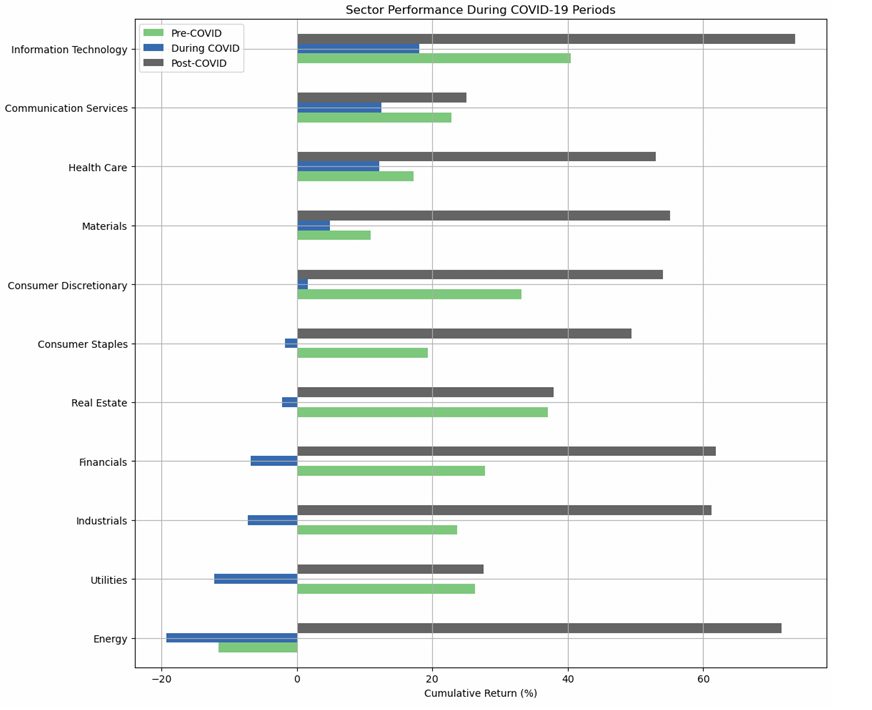
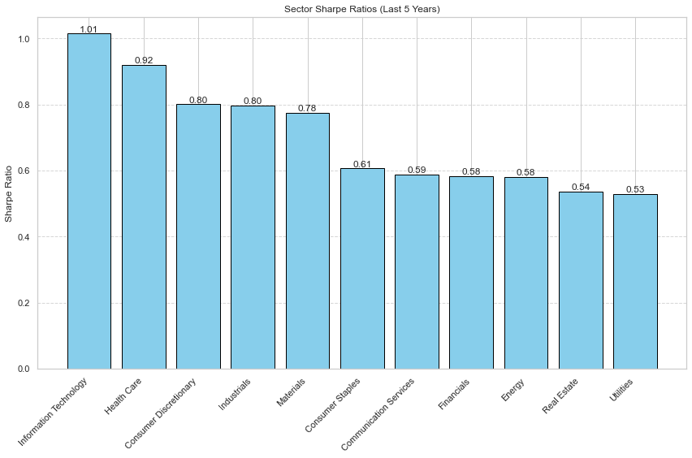

# Stock-Market-Analysis-by-Sector

### 📈 Project Overview
This project conducts comprehensive analysis of stock market performance across various industry sectors to support sustainable investment decision-making. Using Exploratory Data Analysis (EDA) and statistical inference, we investigate sector behaviors, correlations, and performance metrics to identify promising opportunities for long-term investing.

### 🎯 Objectives
- **Correlation Analysis**: Analyze correlations between industry sectors' stock returns  
- **COVID-19 Impact**: Evaluate sector performance during key pandemic periods  
- **Risk Assessment**: Assess sectors' risk-adjusted returns over a 5-year period  
- **Investment Insights**: Identify stable and promising sectors for sustainable investing  

### 🔍 Research Questions
1. Which industry sectors exhibit the strongest correlations in their stock price returns?  
2. How did different sectors perform during key COVID-19 periods (pre-pandemic, pandemic onset, and recovery)?  
3. Which industry sectors offer the best risk-adjusted returns over 5 years?  

### 🛠️ Tools & Technologies

- **Python** 3.10.3
- **Data Analysis**: pandas, numpy  
- **Visualization**: matplotlib, seaborn  
- **Statistical Analysis**: scipy, statsmodels
  
### 📊 Analysis Methodology
#### Exploratory Data Analysis (EDA)

- Summary statistics (mean, median, standard deviation)  
- Time series plotting and trend analysis  
- Sector-wise distribution analysis  
- Correlation heatmaps  
- Outlier detection using box plots
  
#### Statistical Inference
| #  | Research Question                                                                                           | Test                 | Reason                                                                                  |
| -- | ----------------------------------------------------------------------------------------------------------- | -------------------- | -------------------------------------------------------------------------------------------- |
| Q1 | Which industry sectors exhibit the strongest correlations in their stock price returns?                     | Spearman correlation | Assess strength and direction of monotonic relationships between sector return pairs         |
| Q2 | How did different sectors perform during key COVID-19 periods (pre-pandemic, pandemic onset, and recovery)? | Kruskal-Wallis test  | Compare sector returns across different COVID-19 periods (non-parametric test for 3+ groups) |
| Q3 | Which industry sectors offer the best risk-adjusted returns over 5 years                                    | Kruskal-Wallis test  | Compare Sharpe ratios across sectors to identify differences in risk-adjusted performance    |

### 📊 Key Findings (To be filled)

#### (Q1) Correlation Analysis 
- **Strongest correlations**: [Financials - Industrials]: r = 0.852745
- **Weakest correlations**: [Energy - Real Estate]: r = 0.214914
- **Insight**: Although Financials and Industrials show the highest correlation, both sectors are also strongly correlated with others—for example, Industrials with Materials (0.8332) and Financials with Materials (0.7937).

#### (Q2) COVID-19 Impact 
| Period | Best Performer | Worst Performer |
|--------|----------------|-----------------|
| Pre-pandemic | Information Technology (+40.07%)| Energy (-11.57%) |
| Pandemic onset | Information Technology (+17.98%) | Energy (-19.33%) |
| Recovery | Information Technology (+73.28%) | Communication Services (+26.48%) |

#### (Q3) Risk-Adjusted Returns 
- **Highest Sharpe Ratio**: Information Technology (1.014457)
- **Lowest Sharpe Ratio**: Utilities (0.529603)
- **Recommendation**: Information Technology showed the highest risk-adjusted returns. It suggests that higher allocation to this sector could enhance long-term growth.

### 📊 Key Visualizations 

#### Sector Correlation Heatmap

#### COVID-19 Period Performance

#### Sharpe Ratio

### 🗂️ Data Sources
- [Kaggle] https://www.kaggle.com/datasets/iveeaten3223times/massive-yahoo-finance-dataset
- [GitHub] https://github.com/datasets/s-and-p-500-companies

### 📜 About The Project
This project was developed as part of a data science coursework with a focus on practical financial analysis applications.
I plan to extend it into another project that explores my personal interest in finance in the future.
